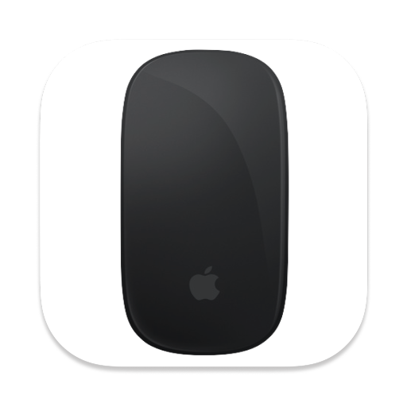

#  Right Click | Alfred Workflow

Trigger a right-click on anywhere with the keyboard.

## Install

- Get it on GitHub [here](https://github.com/vanstrouble/right-click-alfred-workflow/releases)

## Usage

Configure the [Hotkey](https://www.alfredapp.com/help/workflows/triggers/hotkey/) to trigger a right-click in Finder selections via the keyboard.

---

Inspired by [Right Click](https://github.com/vitorgalvao/right-click-workflow.git) workflow by Vitor Galvão.
